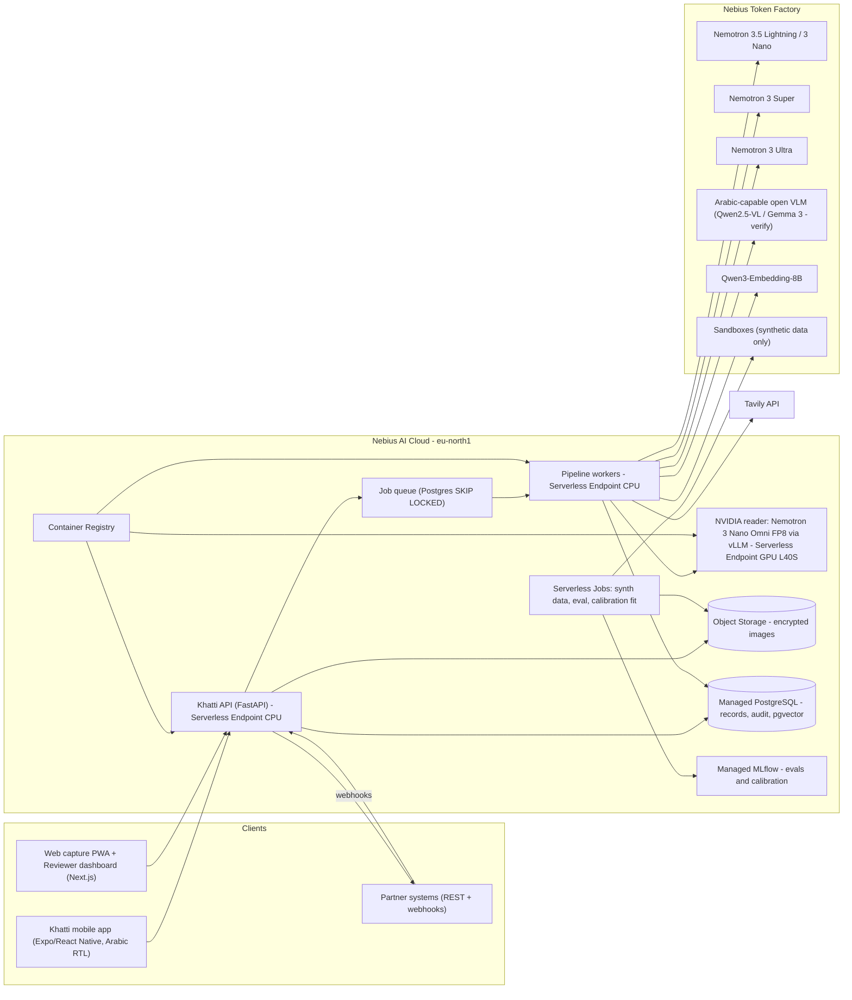

# Khatti API — Plan & Architecture

> Source: plan shared by the project owner. The copy received ends partway through
> section D (model routing); the remainder is still to be added.

**Recommendation: enter Khatti in the Best Apps and Agents track. The main product is the KYC Document Agent: an Arabic-first reader that reads Iraqi onboarding documents, cross-checks them, and hands the file to a human when unsure. Build it as a Nemotron-orchestrated pipeline on Nebius Token Factory, with an NVIDIA vision model self-hosted on a Nebius Serverless Endpoint.** One finding changes the architecture. None of the NVIDIA vision or OCR models I could verify list Arabic as a supported language, and Token Factory's public Nemotron endpoints are text-only as far as I could verify. So Nemotron does the reasoning, validation and routing. An ensemble of image readers, at least one of them NVIDIA, does the Arabic perception. Disagreement between readers becomes a confidence signal.

## TL;DR

- **What to build and where:** Enter a single project in **Best Apps and Agents**. KYC is the flagship demo. The cashier price book and personal capture are shown as the same engine with different schemas, not as separate products. Iraqi residents appear eligible. OFAC's Iraq program is targeted (list-based), not a comprehensive embargo. Prize payment will need a W-8BEN, and possibly withholding.
- **Models:** Nemotron 3.5 Lightning / 3 Nano ($0.06/$0.24 per M tokens) for fast calls. Nemotron 3 Super ($0.30/$0.90) for structuring and tool calls. Nemotron 3 Ultra ($1/$3) only for routed files and reviewer summaries. Nemotron 3 Nano Omni is dedicated-only on Token Factory, so self-host it on a Nebius Serverless Endpoint as the NVIDIA image reader. Add an Arabic-capable open VLM as a second reader. Run a week-1 bake-off on your synthetic set to decide which reader is primary.
- **Data and delivery:** Keep everything on Nebius (region eu-north1): Object Storage, Managed PostgreSQL, Serverless Jobs for synthetic data and evals, Managed MLflow, Container Registry, and Terraform (`nebius/nebius`). Use GCP only as a documented portability target. The deadline is **Oct 30, 2026, 10:00 PT (20:00 Mosul time)**. Aim to submit on Oct 28 and keep 48 hours of buffer.

---

## Key Findings

### 1. Eligibility (Iraq)
- **The rule:** the hackathon excludes residents of jurisdictions "where the laws of the United States or local law prohibits participating or receiving a prize… (including, but not limited to, Brazil, Quebec, Russia, Crimea, Cuba, Iran, and North Korea and any other country which is comprehensively sanctioned by the U.S. Treasury's Office of Foreign Assets Control)". Iraq is not on that list.
- **OFAC status:** Iraq is *not* comprehensively sanctioned.
  - The trade import and export prohibitions ended on July 30, 2004, under E.O. 13350. OFAC then formally removed the Iraqi Sanctions Regulations (31 CFR Part 575) effective September 13, 2010 (75 FR 55462).
  - It was replaced by the Iraq Stabilization and Insurgency Sanctions Regulations (31 CFR Part 576). Those block specific listed persons (the former regime, people threatening stabilization). They do not bar residents generally.
  - **Conclusion:** you are eligible, provided you are not on the SDN list and Iraqi law does not bar you.
- **Prize payment:**
  - The rules state "residents of other countries may be required to provide a completed W-8BEN form". The Sponsor/Devpost "reserves the right to withhold a portion of the prize amount to comply with the tax laws".
  - Payment arrives within 60 days of the Required Forms, which are due 10 business days after being sent. You bear wire and FX fees.
  - Iraq is not on the IRS list of US income tax treaties. Default US withholding is 30%, which could apply if Devpost treats the prize as US-source. The Sponsor is Nebius B.V. in the Netherlands, so this is uncertain. Ask Devpost support early.
  - Prepare a bank account that can receive international USD SWIFT transfers, and have Central Bank of Iraq compliance paperwork ready for a large inbound wire.
- **City awards:** the $500 City Winner Awards are tied to 20 listed cities. None is in Iraq or nearby, so plan on Overall, Track and Tavily prizes only.
- **Prize stacking:** a project can win "one (1) Overall Award OR one (1) Track Award and one (1) Bonus Award".

### 2. NVIDIA models on Token Factory, and the Arabic gap

| Model (Token Factory ID where known) | Availability on Token Factory | Price in/out per 1M tokens | Context | Arabic evidence | Role in Khatti |
|---|---|---|---|---|---|
| `nvidia/Nemotron-3_5-Lightning` (30B, 3B active) | Public | $0.06 / $0.24 | 1,024K | Not stated | Doc classification, capture-guidance messages, cashier Q&A, router |
| `nvidia/NVIDIA-Nemotron-3-Nano-30B-A3B` | Public (FP8) | $0.06 / $0.24 | 262K | Base-model card lists Arabic; post-trained card lists fewer languages (conflict) | Fallback fast model; LLM-as-judge in evals |
| `nvidia/nemotron-3-super-120b-a12b` | Public (FP4) | $0.30 / $0.90 | 256K | Not stated | Maps reader output to the schema, tool-calling agent, `/ask` |
| `nvidia/Nemotron-3-Ultra-550b-a55b` | Public (FP4) | $1.00 / $3.00 | 1,024K | Not stated | Cross-document adjudication and reviewer summary (routed files only) |
| Nemotron 3 Nano Omni 30B-A3B (image/video/audio in) | **Dedicated-only** on Token Factory | Dedicated-endpoint pricing | 256K | Model card: "Language support: English only" | Self-hosted NVIDIA image reader (layout, digits, dates, quality) |
| Nemotron Nano 12B v2 VL | Hosted on Nebius AI Studio (Oct 2025); **current public status unverified** | Unverified | 128K | No Arabic listed | Alternative self-hosted reader |
| Nemotron OCR v2 | Not on Token Factory; open weights (NGC/HF) | Self-host | — | No Arabic | Experimental text-region detector for occlusion/cut-off checks only |
| Nemotron Parse 1.1 | Not on Token Factory | Self-host | — | "Currently focused on English" | Not recommended |

- **Fine-tuning:** no self-service fine-tuning for these models. Do not plan a Nemotron LoRA before the deadline.
- **Hosted readers:** other builders report Token Factory serves no image-input Nemotron. Nebius's document-intelligence page still mentions Qwen2.5-VL and Nemotron Nano 2 VL. **Treat as unverified until `GET /v1/models?verbose=true` confirms it on your key.**
- **Non-NVIDIA vision options:** Qwen2.5-VL-72B-Instruct, Kimi-K2.6, Gemma 3 27B (140+ languages), a new DeepSeek multimodal model. Qwen2.5-VL-72B prices conflict between sources; verify in the console.
- **Embeddings:** Qwen3-Embedding-8B on Token Factory (4,096-dim, multilingual).

**What this means:** the NVIDIA requirement is easily met by Nemotron on Token Factory. The credible technical story is that Arabic handwriting is exactly where these models are weakest. The winning design treats perception as uncertain, measures that uncertainty, and routes to people — "blank and flagged beats invented".

### 3. Nebius platform capabilities (verified)
- **Token Factory API:** OpenAI-compatible, base URL `https://api.tokenfactory.nebius.com/v1/` (regional: `api.tokenfactory.us-central1.nebius.com`). Images as URL or base64. Structured output via `response_format` (`json_schema` / `json_object`) or `guided_json` in `extra_body`; support varies by model. `logprobs` in the request schema; per-model support unverified.
- **Token Factory Sandboxes (beta):** VM-level isolation, git-like branching, free in beta. **Do not upload personal or sensitive data — synthetic data only.**
- **Serverless AI (Jobs, Endpoints, DevPods):** public preview; per-second billing; stopped endpoints are not billed. Preemptible capacity moves to dynamic spot pricing on **Oct 8, 2026**; choose settings by **Oct 7, 23:59 UTC**.
- **Other services:** Managed PostgreSQL (GA), Object Storage (S3-compatible), Container Registry in all regions; Managed MLflow in eu-north1 and others; Terraform provider `nebius/nebius` with state in Object Storage.

### 4. Credits
- Builder Program credits for Token Factory, Tavily and Nebius Academy (reported $25 + $25). **Budget GPU-hours for the self-hosted endpoint as possible out-of-pocket spend.**

---

## Details

### A. Positioning: one engine, three schemas, one track
- **Track: Best Apps and Agents** — the track text asks for Nemotron-powered apps, Ultra for serious reasoning, Nano/Super for everyday calls, and encourages Serverless Endpoints and Jobs.
- **Not Personal AI** — that track expects persistent memory plus NemoClaw/OpenShell/Hermes; a KYC agent would look like a rebrand.
- **Avoid the "superficial rebrand" failure:**
  1. Title and hero flow are KYC ("Khatti — Arabic document agent that knows when to hand over"); ~70% of the video is KYC.
  2. The general engine is the *architecture*: a `DocumentType` registry maps each type to a schema, validators and cross-document rules. KYC, receipts and notes are registry entries.
  3. Cashier gets ~25 seconds as proof of generality and the Tavily showcase. Personal capture only in the roadmap. No second entry.

### B. End-to-end architecture

- **Region: eu-north1 (Finland).** Has every needed service including Managed MLflow. me-west1 (Israel) is advised against for an Iraqi KYC product (2022 Iraqi anti-normalization law; confirm with Iraqi counsel). eu-west1 (France) is the alternative; measure RTT from Mosul in week 1.
- **Queue:** Postgres `SELECT … FOR UPDATE SKIP LOCKED`. No Redis/Kafka.
- **API and workers:** CPU containers on Serverless Endpoints; Managed Kubernetes is the scale-out path.
- **GPU endpoint:** Omni FP8 needs ≥1× L40S 48GB; run on a schedule, stop when idle. The pipeline degrades gracefully to the Token Factory reader when it is down and records `reader_nvidia: unavailable` in the audit trail.

### C. Nebius vs Google Cloud for storage

| Criterion | Nebius (eu-north1) | Google Cloud (Doha/Dammam) |
|---|---|---|
| Hackathon scoring | Strengthens "Technological Implementation" | Neutral or negative |
| Latency from Mosul | Europe round trip; upload once per image | Likely lower RTT (unverified) |
| Co-location with inference | Same cloud; no egress | Cross-cloud egress per image |
| Data residency | EU / GDPR; SOC 2 Type II, ISO 27001 | Gulf, still not Iraq |
| Portability | S3 API, standard Postgres | GCS S3-interop, Cloud SQL |

**Recommendation: Nebius for everything now.** Keep portability real: S3 API only (boto3 with `endpoint_url`), no vendor SDKs in business code, standard Postgres, Terraform modules per provider. A storage adapter can later point at on-prem MinIO in Iraq.

### D. Model routing

*(Section truncated in the received copy.)* From the TL;DR and model table:

| Stage | Model |
|---|---|
| Capture quality check | Deterministic CV (OpenCV) first, then Nemotron 3.5 Lightning … |
| Fast calls (classification, guidance, cashier Q&A) | Nemotron 3.5 Lightning / 3 Nano |
| Structuring, tool calls, routing | Nemotron 3 Super |
| Cross-document adjudication, reviewer summary (routed files only) | Nemotron 3 Ultra |

---

## Build status

| Area | Status |
|---|---|
| Reader ensemble, Arabic normalisation, per-field consensus | ✅ |
| Deterministic checks (Iraqi NID, expiry, age, MRZ, cross-document) | ✅ |
| `DocumentType` registry (schema + validators + cross-document rules) | ✅ |
| Tiered Nemotron: Super router with guardrails, Ultra reviewer summary on routed files | ✅ |
| NVIDIA reader availability recorded per case (graceful degradation) | ✅ |
| Async cases: Postgres SKIP LOCKED queue, S3 Object Storage, audit trail, signed webhooks | ✅ |
| Cashier price-book schema + Tavily price reference | ☐ |
| Capture quality check (OpenCV) | ☐ |
| Terraform (`nebius/nebius`), Container Registry images, Serverless Endpoints | ☐ |
| NVIDIA reader (Nano Omni FP8 via vLLM) on Serverless GPU endpoint | ☐ |
| Synthetic data + eval/calibration Jobs, MLflow | ☐ |
| Reviewer dashboard (Next.js), mobile capture (Expo, RTL) | ☐ |
| Submission video, README polish — target Oct 28 | ☐ |
