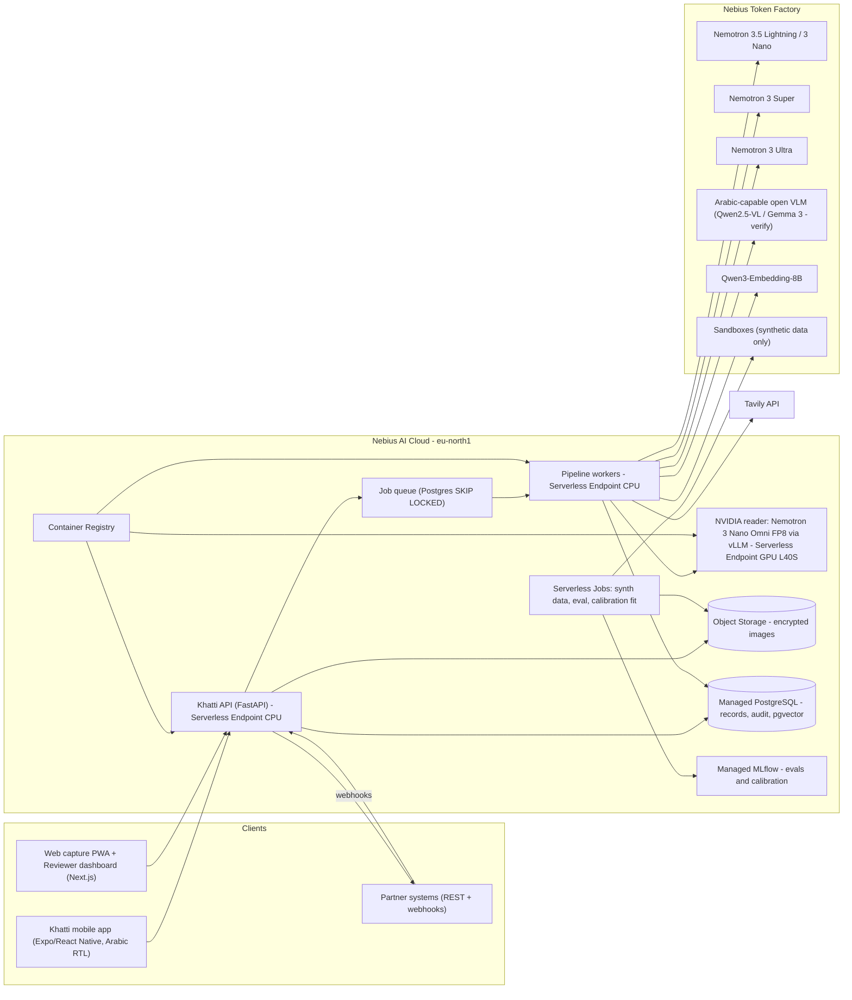
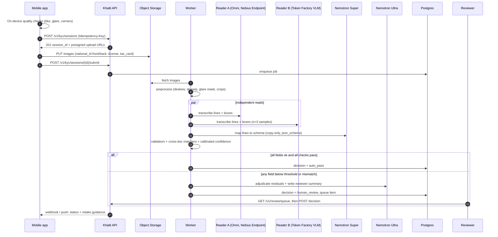

# Khatti API — Plan & Architecture

**Recommendation: enter Khatti in the Best Apps and Agents track. The main product is the KYC Document Agent: an Arabic-first reader that reads Iraqi onboarding documents, cross-checks them, and hands the file to a human when unsure. Build it as a Nemotron-orchestrated pipeline on Nebius Token Factory, with an NVIDIA vision model self-hosted on a Nebius Serverless Endpoint.** One finding changes the architecture. None of the NVIDIA vision or OCR models I could verify list Arabic as a supported language, and Token Factory's public Nemotron endpoints are text-only as far as I could verify. So Nemotron does the reasoning, validation and routing. An ensemble of image readers, at least one of them NVIDIA, does the Arabic perception. Disagreement between readers becomes a confidence signal.

## TL;DR

- **What to build and where:** Enter a single project in **Best Apps and Agents**. KYC is the flagship demo. The cashier price book and personal capture are shown as the same engine with different schemas, not as separate products. Iraqi residents appear eligible. OFAC's Iraq program is targeted (list-based), not a comprehensive embargo. Prize payment will need a W-8BEN, and possibly withholding.
- **Models:** Nemotron 3.5 Lightning / 3 Nano ($0.06/$0.24 per M tokens) for fast calls. Nemotron 3 Super ($0.30/$0.90) for structuring and tool calls. Nemotron 3 Ultra ($1/$3) only for routed files and reviewer summaries. Nemotron 3 Nano Omni is dedicated-only on Token Factory, so self-host it on a Nebius Serverless Endpoint as the NVIDIA image reader. Add an Arabic-capable open VLM as a second reader. Run a week-1 bake-off on your synthetic set to decide which reader is primary.
- **Data and delivery:** Keep everything on Nebius (region eu-north1): Object Storage, Managed PostgreSQL, Serverless Jobs for synthetic data and evals, Managed MLflow, Container Registry, and Terraform (`nebius/nebius`). Use GCP only as a documented portability target. The deadline is **Oct 30, 2026, 10:00 PT (20:00 Mosul time)**. Aim to submit on Oct 28 and keep 48 hours of buffer.

---

## Key Findings

### 1. Eligibility (Iraq)
- **The rule:** the hackathon excludes residents of jurisdictions "where the laws of the United States or local law prohibits participating or receiving a prize… (including, but not limited to, Brazil, Quebec, Russia, Crimea, Cuba, Iran, and North Korea and any other country which is comprehensively sanctioned by the U.S. Treasury's Office of Foreign Assets Control)". [devpost](https://nebiusglobalaihackathon.devpost.com/rules) Iraq is not on that list.
- **OFAC status:** Iraq is *not* comprehensively sanctioned. [LegalClarity](https://legalclarity.org/iraq-sanctions-current-us-regulations-and-prohibitions/)
  - The trade import and export prohibitions ended on July 30, 2004, under E.O. 13350. OFAC then formally removed the Iraqi Sanctions Regulations (31 CFR Part 575) effective September 13, 2010 (75 FR 55462).
  - It was replaced by the Iraq Stabilization and Insurgency Sanctions Regulations (31 CFR Part 576). Those block specific listed persons (the former regime, people threatening stabilization). [www.visualofac.com](https://www.visualofac.com/resources/full-sanctions/iraq-sanctions/) [treasury](https://ofac.treasury.gov/media/7341/download) They do not bar residents generally.
  - **Conclusion:** you are eligible, provided you are not on the SDN list and Iraqi law does not bar you.
- **Prize payment:**
  - The rules state "residents of other countries may be required to provide a completed W-8BEN form". The Sponsor/Devpost "reserves the right to withhold a portion of the prize amount to comply with the tax laws". [devpost](https://nebiusglobalaihackathon.devpost.com/rules)
  - Payment arrives within 60 days of the Required Forms, which are due 10 business days after being sent. You bear wire and FX fees. [devpost](https://nebiusglobalaihackathon.devpost.com/rules)
  - Iraq is not on the IRS list of US income tax treaties. Without a treaty, the IRS says you "must pay tax on the income in the same way and at the same rates shown in the instructions". Default US withholding is 30%, which could apply if Devpost treats the prize as US-source. The Sponsor is Nebius B.V. in the Netherlands, [devpost](https://nebiusglobalaihackathon.devpost.com/rules) so this is uncertain. Ask Devpost support early.
  - Prepare a bank account that can receive international USD SWIFT transfers, and have Central Bank of Iraq compliance paperwork ready for a large inbound wire.
- **City awards:** the $500 City Winner Awards are tied to 20 listed cities. [Tierones](https://tierones.io/opportunities/nebius-nvidia-ai-2026) [devpost](https://nebiusglobalaihackathon.devpost.com/rules) None is in Iraq or nearby, so plan on Overall, Track and Tavily prizes only.
- **Prize stacking:** a project can win "one (1) Overall Award OR one (1) Track Award and one (1) Bonus Award". [devpost](https://nebiusglobalaihackathon.devpost.com/rules)

### 2. NVIDIA models on Token Factory, and the Arabic gap

| Model (Token Factory ID where known) | Availability on Token Factory | Price in/out per 1M tokens | Context | Arabic evidence | Role in Khatti |
|---|---|---|---|---|---|
| `nvidia/Nemotron-3_5-Lightning` (30B, 3B active) | Public | $0.06 / $0.24 | 1,024K | Not stated | Doc classification, capture-guidance messages, cashier Q&A, router |
| `nvidia/NVIDIA-Nemotron-3-Nano-30B-A3B` | Public (FP8) | $0.06 / $0.24 | 262K | Base-model card lists Arabic; post-trained card lists fewer languages (conflict) [Hugging Face](https://huggingface.co/nvidia/NVIDIA-Nemotron-3-Nano-30B-A3B-FP8) [Hugging Face](https://huggingface.co/nvidia/NVIDIA-Nemotron-3-Nano-30B-A3B-Base-BF16) | Fallback fast model; LLM-as-judge in evals |
| `nvidia/nemotron-3-super-120b-a12b` | Public (FP4) | $0.30 / $0.90 | 256K | Not stated | Maps reader output to the schema, tool-calling agent, `/ask` |
| `nvidia/Nemotron-3-Ultra-550b-a55b` | Public (FP4) | $1.00 / $3.00 | 1,024K | Not stated | Cross-document adjudication and reviewer summary (routed files only) |
| Nemotron 3 Nano Omni 30B-A3B (image/video/audio in) | **Dedicated-only** on Token Factory [nebius](https://nebius.com/services/token-factory/models/nvidia-nemotron-models-inference) | Dedicated-endpoint pricing | 256K | Model card: "Language support: English only" [huggingface](https://huggingface.co/nvidia/Nemotron-3-Nano-Omni-30B-A3B-Reasoning-BF16) [The Rundown AI](https://www.therundown.ai/tools/nemotron-3-nano-omni) | Self-hosted NVIDIA image reader (layout, digits, dates, quality) |
| Nemotron Nano 12B v2 VL | Hosted on Nebius AI Studio (Oct 2025); **current public status unverified** [Nebius](https://nebius.com/blog/posts/nebius-status-board-now-structured-by-region) [nebius](https://nebius.com/blog/posts/nvidia-nemotron-nano-2-vl-in-ai-studio) | Unverified | 128K [Freellm](https://freellm.net/models/nvidia-nim/nvidia-nemotron-nano-12b-v2-vl) | Card languages: DE, ES, FR, IT, KO, PT, RU, JA, ZH, EN (no Arabic) [Hugging Face](https://huggingface.co/nvidia/NVIDIA-Nemotron-Nano-12B-v2-VL-FP8) | Alternative self-hosted reader |
| Nemotron OCR v2 | Not on Token Factory; open weights (NGC/HF) | Self-host | — | Multilingual variant: EN, ZH, JA, KO, RU (no Arabic) [huggingface](https://huggingface.co/nvidia/nemotron-ocr-v2) | Experimental text-region detector for occlusion/cut-off checks only |
| Nemotron Parse 1.1 | Not on Token Factory | Self-host | — | "Currently focused on English" [NVIDIA Developer](https://developer.nvidia.com/blog/turn-complex-documents-into-usable-data-with-vlm-nvidia-nemotron-parse-1-1/) | Not recommended |

Notes on the table:
- **Fine-tuning:** Nebius says "The current catalog does not list self-service fine-tuning for the highlighted models". Do not plan a Nemotron LoRA before the deadline. [nebius](https://nebius.com/services/token-factory/models/nvidia-nemotron-models-inference)
- **Hosted readers:** other hackathon builders found that "Token Factory serves no image-input Nemotron (Nano and Super answer 400 does not support image input)". [GitHub](https://github.com/vansyson1308/imageforagent/pull/3) Another wrote: "The NVIDIA models on Token Factory are text models." [GitHub](https://github.com/Marc-Dvci/RxLint) Nebius's own document-intelligence page still says Token Factory serves "VLMs like Qwen2.5-VL and Nemotron Nano 2 VL". [nebius](https://nebius.com/solutions/document-intelligence) **Treat that as unverified until `GET /v1/models?verbose=true` confirms it on your key.**
- **Non-NVIDIA vision options:**
  - Nebius lists Qwen2.5-VL-72B-Instruct and Kimi-K2.6 as vision models. [Nebius](https://nebius.com/solutions/vision)
  - OpenRouter's Nebius provider page lists Gemma 3 27B ($0.10/$0.30; "vision-language input", 140+ languages). [OpenRouter](https://openrouter.ai/provider/nebius) [openrouter](https://openrouter.ai/provider/nebius)
  - A new DeepSeek multimodal model appears on the Token Factory homepage. [Nebius](https://tokenfactory.nebius.com/)
  - Prices for Qwen2.5-VL-72B conflict between third-party sources ($0.13/$0.40 vs $0.25/$0.75). [Getmaxim](https://www.getmaxim.ai/bifrost/llm-cost-calculator/provider/nebius/model/qwen2.5-vl-72b-instruct) [Future AGI](https://futureagi.com/llm-cost-calculator/nebius/qwen-qwen2-5-vl-72b-instruct/) Verify in the console.
- **Embeddings:** Qwen3-Embedding-8B is on Token Factory (4,096-dim, multilingual). [Nebius](https://nebius.com/services/token-factory/models/qwen-models-inference) [openrouter](https://openrouter.ai/provider/nebius) It is not an NVIDIA model, which is fine because the NVIDIA requirement is met elsewhere.

**What this means:** the "NVIDIA open model" requirement is easily met by Nemotron on Token Factory. The *credible* technical story is harder and more interesting than "the VLM reads it". Arabic handwriting is exactly where these models are weakest. The winning design treats perception as uncertain, measures that uncertainty, and routes to people. That matches the brief's "blank and flagged beats invented".

### 3. Nebius platform capabilities (verified)
- **Token Factory API:**
  - OpenAI-compatible, base URL `https://api.tokenfactory.nebius.com/v1/`. [Nebius +2](https://docs.tokenfactory.nebius.com/api-reference/examples/vision-capabilities)
  - Regional variant: `api.tokenfactory.us-central1.nebius.com`. [nebius](https://nebius.com/services/token-factory/nemotron)
  - Images can be sent as a URL or base64. [nebius](https://docs.tokenfactory.nebius.com/api-reference/examples/vision-capabilities)
  - Structured output via `response_format` (`json_schema` / `json_object`), plus `guided_json` in `extra_body`. Support varies by model; look for the "JSON mode" tag. [Nebius](https://docs.tokenfactory.nebius.com/api-reference/examples/vision-capabilities) [nebius](https://docs.tokenfactory.nebius.com/ai-models-inference/json)
  - Request schema includes `logprobs` / `top_logprobs`. [Nebius](https://docs.tokenfactory.nebius.com/api-reference/inference/create-chat-completion) Per-model support is unverified.
- **Token Factory Sandboxes:**
  - In beta: "VM-level isolation", "Git-like branching", OCI image import, Python SDK/CLI/MCP. [nebius](https://docs.tokenfactory.nebius.com/sandboxes/overview) [Nebius](https://docs.tokenfactory.nebius.com/sandboxes/overview)
  - Beta limit: 50 simultaneous operations; checkpoint retention 180 days. [nebius](https://docs.tokenfactory.nebius.com/sandboxes/overview)
  - "Free while in beta — runs don't consume your credits". [Nebius](https://tokenfactory.nebius.com/sandboxes/about)
  - "While in beta, don't upload or process files containing personal or sensitive data". [Nebius](https://tokenfactory.nebius.com/sandboxes/about) **Never send customer images there.** Synthetic data only.
- **Serverless AI (Jobs, Endpoints, DevPods):**
  - Launched in public preview with AI Cloud 3.5 (March 2026). [barchart](https://www.barchart.com/story/news/987392/nebius-ai-cloud-3-5-introduces-serverless-ai-to-give-developers-frictionless-compute-for-real-world-ai)
  - Per-second billing under Compute pricing: "While an endpoint is stopped, you are not billed for computing resources or storage." [Nebius AI Cloud](https://docs.nebius.com/serverless/pricing-quotas) [Nebius AI Cloud](https://docs.nebius.com/overview/services)
  - Preemptible capacity moves to dynamic spot pricing on **October 8, 2026**. Settings must be chosen by **Oct 7, 23:59 UTC**. [GitHub](https://github.com/sagemathinc/cocalc-ai/issues/684)
- **Other services:**
  - Managed PostgreSQL (GA), Object Storage (S3-compatible), and Container Registry are in all regions. [Nebius +2](https://nebius.com/blog/posts/managed-postgresql-in-ga)
  - Managed MLflow is in eu-north1, me-west1, us-central1, uk-south1 and eu-west2. [Nebius AI Cloud](https://docs.nebius.com/overview/services)
  - Official Terraform provider `nebius/nebius`. State can be stored in Object Storage (docs example uses `https://storage.eu-north1.nebius.cloud`). [Nebius AI Cloud](https://docs.nebius.com/terraform-provider/store-terraform-state)

### 4. Credits
- **Builder Program:** credits for Token Factory, Tavily and Nebius Academy. [devpost](https://nebiusglobalaihackathon.devpost.com/rules) A third-party tracker reports $25 Token Factory credit with the event code plus $25 for joining the Builders Program. [Tierones](https://tierones.io/opportunities/nebius-nvidia-ai-2026) Devpost advertises "$400+ in credits from Nebius, LangChain, Toloka, Tavily and more." [X](https://x.com/devpost/status/2098096161647153420)
- **Budget risk:** AI Cloud GPU credits beyond that appear tied to in-person Builders & Brews events. [Devpost](https://nebiusglobalaihackathon.devpost.com/resources) **Budget GPU-hours for the self-hosted endpoint as possible out-of-pocket spend.**

---

## Details

### A. Positioning: one engine, three schemas, one track

**Track choice: Best Apps and Agents.**
- The track text asks for "any app or agent someone would actually use… Power it with Nemotron models… Reach for Nemotron 3 Ultra when you need serious reasoning, and let Nano or Super handle the fast, everyday calls". It also encourages Serverless Endpoints and Jobs. [devpost](https://nebiusglobalaihackathon.devpost.com/rules) That is almost exactly the model-routing design below.
- **Why not Personal AI:** that track expects persistent memory plus tools like NemoClaw, OpenShell or Hermes Agent. [devpost](https://nebiusglobalaihackathon.devpost.com/rules) A KYC agent would look like a rebrand there.

**How to avoid Stage 1's "superficial rebrand" failure:**
1. **Title and hero flow are KYC.** Name it "Khatti — Arabic document agent that knows when to hand over". About 70% of the video is the KYC flow.
2. **The general engine is the *architecture*, not the pitch.** A `DocumentType` registry maps each type to a schema, validators and cross-document rules. KYC, receipts and notes are three registry entries.
3. **Cashier gets ~25 seconds** as proof of generality and as the Tavily showcase (price reference). Personal capture/reminders appear only in the roadmap slide and README. Do **not** submit a second Personal AI entry. Multiple entries must be "substantially different", [devpost](https://nebiusglobalaihackathon.devpost.com/rules) and you don't have the time.

### B. End-to-end architecture



Design choices:
- **Region: eu-north1 (Finland).** It has every service you need, including Managed MLflow, [Nebius AI Cloud](https://docs.nebius.com/overview/regions) [Nebius AI Cloud](https://docs.nebius.com/overview/services) and is Nebius's most established region.
  - me-west1 (Israel) is geographically closest, [Nebius AI Cloud](https://docs.nebius.com/overview/regions) but I advise against it for an Iraqi KYC product. Iraq's parliament passed the law criminalizing normalization with Israel on May 26, 2022 (275 votes). It bans any dealings with companies or institutions linked to Israel, with penalties up to life imprisonment or death. That creates legal and reputational risk for hosting Iraqi citizens' data there. Have Iraqi counsel confirm this before any production decision.
  - eu-west1 (France) is the alternative. [Nebius AI Cloud](https://docs.nebius.com/overview/regions) Measure round-trip time from Mosul to both in week 1 (`curl -w` against an Object Storage endpoint).
- **Queue:** Postgres-backed queue (`SELECT … FOR UPDATE SKIP LOCKED`). No Redis or Kafka means fewer moving parts. Swap to NATS/Kafka if volume ever justifies it.
- **API and workers:** CPU containers on Serverless Endpoints for the hackathon, since that is Nebius-native and scores points. Managed Kubernetes is the documented scale-out path using the same images.
- **GPU endpoint:** Omni FP8 needs "1× L40S 48GB" at minimum, according to NVIDIA's card. [huggingface](https://huggingface.co/nvidia/Nemotron-3-Nano-Omni-30B-A3B-Reasoning-BF16) It runs on a schedule and is **stopped when idle** (no charge when stopped). [Nebius AI Cloud](https://docs.nebius.com/serverless/pricing-quotas) The pipeline degrades gracefully to the Token Factory reader when the endpoint is down, and marks `reader_nvidia: unavailable` in the audit trail.

### C. Nebius vs Google Cloud for storage

| Criterion | Nebius (eu-north1) | Google Cloud (e.g., Doha/Dammam regions) |
|---|---|---|
| Hackathon scoring | Directly strengthens "Technological Implementation" (Nebius usage) | Neutral or negative; judges ask "where did Nebius help?" |
| Latency from Mosul | Europe round trip; measure it. Upload happens once per image, so it matters less than inference latency | Likely lower RTT from the Gulf regions (unverified; measure) |
| Co-location with inference | Same cloud as Serverless GPU endpoint and Jobs; no egress between storage and compute | Cross-cloud egress on every image read |
| Data residency | EU jurisdiction and GDPR posture; Nebius cites SOC 2 Type II, ISO 27001 [Datacenters.com](https://www.datacenters.com/providers/nebius) | Gulf residency is closer to the region, but still not in Iraq |
| Portability | S3-compatible API and standard Postgres | GCS supports S3-interop HMAC keys; Cloud SQL Postgres |

**Recommendation: Nebius for everything now.** Keep portability real: use the S3 API only (boto3 with `endpoint_url`), no vendor SDKs in business code, standard Postgres, and Terraform modules per provider. If a bank customer later demands in-country storage, a storage adapter can point at on-prem MinIO in Iraq.

### D. Model routing

| Stage | Model | Why |
|---|---|---|
| Capture quality check (server side) | Deterministic CV (OpenCV) first. Nemotron 3.5 Lightning only turns metrics into a friendly Arabic/English message | Cheap and deterministic; LLMs are poor at judging blur |
| Document classification | Reader VLM caption + Lightning over the caption + layout cues. Hard rules (card aspect ratio ≈ ID-1) | Fast, cheap; confusion is rare with only 3 KYC types |
| Transcription (perception) | **Reader A:** NVIDIA Nemotron 3 Nano Omni (self-hosted). **Reader B:** Arabic-capable VLM on Token Factory. The bake-off decides the primary | Two independent readers let agreement act as confidence |
| Field structuring | Nemotron 3 Super with `json_schema` output. The rule is **copy-only**: every value must be a verbatim span from reader output, with a line ID | Stops the structurer from inventing values |
| Validation | Deterministic Python (no LLM) | Auditable and testable |
| Cross-document adjudication | Deterministic matchers first. Nemotron 3 Ultra only for residual ambiguity (e.g., a missing grandfather name vs a different person) | Ultra's cost only where reasoning adds value |
| Reviewer summary | Nemotron 3 Ultra, writing around locked placeholders (`{{field:id_number}}`) so it cannot alter values | Readable summary without the risk of changed values |

**Week-1 bake-off (decision gate, due Oct 3):** run 60 synthetic images (20 per type, mixed quality) through each candidate reader. Score character error rate (CER) on Arabic name lines and exact match on digit fields. Measure Arabic-Indic numerals (٠١٢٣٤٥٦٧٨٩) separately.
- If Omni's Arabic-name CER is within ~5 points of the best non-NVIDIA reader, make Omni primary.
- Otherwise Omni becomes the *numerals, dates, layout and quality* reader and Reader B does Arabic names.
- Either way, report the numbers in the README. Honest per-model results are a strong signal of "genuine understanding of the problem space".

### E. Agent pipeline



**Stages in detail:**
1. **Capture quality check** (client and server run the same metrics): blur (variance of Laplacian), exposure (histogram clipping), glare (saturated blobs over text), framing (four card corners detected, otherwise "corner cut off"), occlusion (finger blob over the card), and resolution (card short side ≥ 600 px).
2. **Classification:** `national_id_front | national_id_back | commercial_registration | tax_card | other`. The KYC session declares the expected slots, so misclassification becomes an explicit "wrong document in slot" exception.
3. **Preprocessing:** perspective warp, deskew, CLAHE contrast, a glare mask (readers get the original plus the enhanced version), and field-region crops from template anchors. Keep every derived image hash in the audit log.
4. **Transcription:** each reader returns `lines[] {line_id, text, bbox, reader_conf?}`. The prompt forbids guessing: "If a character is not legible, output ␣? in its place."
5. **Structuring:** Super receives *only reader lines*, never the image, and a JSON Schema. For each field it returns `{value, source_line_ids[], char_spans}` or `null` with `reason`.
6. **Validation:** see F.
7. **Cross-document consistency:** see F.
8. **Decision:** `auto_pass` only if every *required* field is `ok`, all cross-doc rules pass, no document is expired, and the session-level calibrated probability ≥ τ_doc. Otherwise `human_review` with reasons.
9. **Reviewer summary:** Ultra writes 3–6 bullets: *what* to check, *why* (the signal), *where* (crop thumbnails). The UI re-inserts values from the database.

**Orchestration:** use **LangGraph** or a plain typed state machine for the deterministic pipeline, with Nemotron tool calling via the OpenAI SDK. Wrap it with **NVIDIA NeMo Agent Toolkit** for profiling, evaluation and its Agent Optimizer. NVIDIA describes the toolkit as "compatible with other frameworks, including Semantic Kernel, Google ADK, LangChain, and CrewAI". [NVIDIA Developer](https://developer.nvidia.com/blog/develop-specialized-ai-agents-with-new-nvidia-nemotron-vision-rag-and-guardrail-models/) This adds a second genuine NVIDIA touchpoint without making the core depend on it.

**Where Token Factory Sandboxes fit (synthetic data only, given the beta PII restriction):** let Nemotron Super *generate and test* validator code for new document types. It writes the regex/checksum/normalizer and unit tests, runs them in a Sandbox against synthetic fixtures, and branches to try variants. This becomes the "add a document type" developer workflow.

### F. Validation rules and Arabic handling

**Normalization** (store the raw value, compare the normalized value):
- Digits: Arabic-Indic ٠–٩ and Extended/Persian ۰–۹ → 0–9.
- Remove tatweel (ـ) and harakat/diacritics.
- Unify alef forms أ إ آ ٱ → ا. Map ى → ي and ة → ه *for matching only*.
- Collapse whitespace. Normalize "عبد ال…" compounds by joining "عبد" with the following token.
- **Kurdish (Sorani) awareness:** do not fold ڕ ڵ ێ ۆ ە ڤ پ چ گ ژ into Arabic letters when the script detector flags Kurdish. Run matching per script and cross-script only via a transliteration table.

**Names:**
- Iraqi documents typically carry the four-part name (الاسم الرباعي: given, father, grandfather, great-grandfather) plus a family/tribal surname (اللقب).
- Match token by token with alignment:
  - A license may carry a three-part name: allow a missing trailing token → `partial_match`, not `mismatch`.
  - Order must be preserved.
  - Per-token Jaro–Winkler on normalized forms ≥ 0.92, and exact match required on the given name.
- If one side is Latin script, transliterate with an Arabic→Latin table and compare with a looser threshold. Always route to a human when only transliteration matches.

**Dates:**
- Parse `YYYY/MM/DD`, `DD/MM/YYYY`, Arabic-Indic digits and month names.
- Detect Hijri by an explicit هـ marker or a year in the 1350–1500 range. Convert with an Umm al-Qura library (e.g., `hijridate`) and flag `calendar_converted: true`.
- Checks: `expiry > today`, `issue < expiry`, `issue ≤ today`, `dob` gives age ≥ 18.
- National Card lifetime: Wikipedia lists expiry as "10 years after issuance". [Wikipedia](https://en.wikipedia.org/wiki/Iraq_National_Card) Warn (don't fail) if expiry − issue ≠ 10 years ± 30 days.

**Identifier formats:**
- The National Card number is widely reported as 12 digits. [Grokipedia](https://grokipedia.com/page/Iraq_National_Card) This comes from a weak secondary source, so **treat it as unverified** and configure it as a template parameter.
- **I found no public checksum algorithm. Do not invent one.** Validate length and digit class only, and say so in the README.
- Commercial registration and tax-card numbering formats are **not verified**. Define them in your *synthetic* spec and label them "Iraqi-style (fictional)".

**Cross-document rules (declarative YAML):**
```yaml
rules:
  - id: name_id_vs_license
    left: national_id.full_name_ar
    right: commercial_registration.owner_name_ar
    matcher: arabic_name_aligned
    on_partial: review
  - id: name_id_vs_tax
    left: national_id.full_name_ar
    right: tax_card.holder_name_ar
    matcher: arabic_name_aligned
  - id: business_name_license_vs_tax
    left: commercial_registration.business_name_ar
    right: tax_card.business_name_ar
    matcher: normalized_fuzzy
    threshold: 0.9
  - id: docs_not_expired
    each: [national_id.expiry_date, commercial_registration.expiry_date, tax_card.expiry_date]
    check: after_today
```

### G. Confidence and calibration

**Per-field raw signals (features):**
1. **Reader agreement:** normalized edit similarity between Reader A and Reader B for that field span. This is the strongest signal.
2. **Self-consistency:** agreement across n=3 samples of Reader B (temperature 0.7).
3. **Token logprobs:** mean and min logprob over the value tokens, *if* `logprobs` is returned for that model. The API schema accepts it but per-model support is unverified, so the feature is optional and missing values are imputed.
4. **Validation signals:** format passes, date plausible, cross-doc match score.
5. **Image quality around the field crop:** blur, glare overlap with the field bbox, occlusion.
6. **Field priors:** handwritten vs printed (from the template), field type, document type.
7. **"?" marker present:** the reader flagged an illegible character.

**Calibration model:**
- Fit a logistic regression (Platt-style) on these features, then apply **isotonic regression** on its output. Fit per field type group: names, digits, dates, enums.
- Fit on a dedicated *calibration split*, never on the test split.
- Compare against a temperature-scaled logprob-only baseline to show the ensemble's value.

**Metrics:**
- Expected Calibration Error (ECE, 10 or 15 equal-mass bins) and Brier score.
- Reliability diagrams per field type and for the worst-photo bucket.
- Target: ECE ≤ 0.05 overall. Report it honestly if the worst bucket is worse.

**Thresholds:**
- Choose τ_field per field group so that **precision of auto-accepted fields ≥ 99%** on the calibration split, with a coverage number reported alongside.
- Print the selective-risk curve (coverage vs error) in the README. It is the clearest single chart for judges.

**"Never invent a field" guarantee** (enforced in code, not in prompts):
1. The structurer can only emit values that are exact substrings of reader lines. A validator rejects any value whose `char_spans` don't reproduce it. Rejected → `null`, `status: unreadable`.
2. Any field containing "?" → `null` + `unreadable`, with the partial string kept only in `raw_partial` for the reviewer and never exposed as `value`.
3. If readers disagree beyond a threshold and neither passes validation → `null` + `low_confidence`, with both candidates shown to the reviewer.
4. The Ultra summary cannot introduce values (placeholder substitution).
5. **Metric:** *hallucination rate* = share of fields where ground truth is unreadable or occluded but the system returned a non-null value. Target 0, and report it prominently.

### H. Synthetic dataset plan

**Templates (fictional, "Iraqi-style"):**
- National Card front/back (ID-1 size, Arabic + Kurdish labels), commercial registration certificate (A4, stamp area, handwritten fields), tax card (small card/booklet page, some handwriting).
- **Ethics and safety:**
  - Do not copy real security features, emblems or seals.
  - Use a visible "نموذج / SPECIMEN — FICTIONAL" watermark and fictional ministry names.
  - Never photograph real IDs.
  - This also satisfies the video rule that bans third-party trademarks. [devpost](https://nebiusglobalaihackathon.devpost.com/rules)

**Content generation:**
- Nemotron 3 Super generates fictional Iraqi-style four-part names (with a surname), business names, governorates, addresses, activity descriptions, and numbers that follow your synthetic formats. Deduplicate against a small blocklist of public figures.
- Include deliberate cross-document variants: a missing grandfather name, alef variants, different surname spelling, a swapped business name, an expired license. Also include true mismatches (a different person).

**Rendering:**
- Server-side HTML/SVG → PNG with several Arabic fonts (Naskh, Kufi, Ruqʿah-like), Arabic-Indic vs Western digits, and a Kurdish label line.
- **Handwriting:**
  - (a) Recruit 5–10 volunteers in Mosul to hand-fill printed fictional forms. This is best for realism and a great video moment.
  - (b) Handwriting-style fonts as supplementary data, clearly labeled as weaker.

**Physical capture:** print ~150 documents, then photograph each 3–6 times on 2–3 phones under deliberately bad conditions: dim or backlit lighting, 0–45° angles, glare, thumb or cut-off corner, motion blur, crumpled paper. Tag conditions at capture time.

**Augmentation at scale:** a Nebius Serverless Job (CPU) applies albumentations-style perspective, blur, JPEG compression, shadow and glare overlays to rendered images. Target about 3k tuning images from about 600 renders. The job writes a manifest and pushes it to Object Storage and MLflow.

**Splits:**
- Split **by synthetic identity and by physical print**, never by photo, so the same document never appears in two splits.
- 60% tune / 20% calibration / 20% held-out test. Hash the test manifest into MLflow on day one.
- Also hold out one capture condition (e.g., "backlit window") entirely, and at least one handwriting volunteer, to show generalization.
- Size target: ≥ 100 held-out real photos across the three types, including ≥ 30 in the "worst" bucket.

### I. Evaluation harness (Serverless Jobs + MLflow)

- **Job `eval-run`:** containerized. Takes `{pipeline_version, split, reader_config}`, runs all sessions, and logs to Managed MLflow:
  - Field-level exact match and normalized match per field and per document type.
  - CER on Arabic text fields (Levenshtein over normalized chars) and on digit fields.
  - Null-correctness: precision/recall of `unreadable` against ground truth.
  - Hallucination rate.
  - Calibration: ECE, Brier, reliability diagram PNG artifacts.
  - Human routing: precision/recall/F1 of `human_review` against "a human was actually needed" (ground truth = any wrong or unreadable required field, or a true mismatch). Plus auto-pass error rate (the number a bank cares about).
  - All of the above sliced by quality bucket (good / medium / worst), by handwriting vs print, and by script.
- **Job `calibrate`:** fits the calibrators, versions them as MLflow artifacts, and the API loads the artifact by alias.

### J. Capture-time guidance (stretch, recommended)

**Hybrid:**
- On-device heuristics give instant feedback in under 100 ms: quad detection, blur and glare metrics via frame processors. Messages include "الزاوية مقطوعة، أعد التصوير / The corner is cut off, retake" and "انعكاس ضوء فوق الاسم / glare over the name".
- After upload, the server re-runs the same metrics plus a reader "legibility probe". If a required field would be `unreadable`, it pushes a *specific* retake request ("the expiry date on the back is covered by your thumb") within the session.

### K. API design (OpenAPI 3.1, `/v1`)

**Conventions:**
- Auth: `Authorization: Bearer <api_key>` for tenants; short-lived JWTs for reviewers and the mobile app, minted by `/v1/auth/token`.
- `Idempotency-Key` required on all POSTs (stored 24h).
- Every row has a `tenant_id`, enforced by Postgres Row-Level Security.
- Rate limiting: token bucket per API key; `429` with `Retry-After`.
- Async model: create → upload → submit → poll or webhook. Webhooks are signed with HMAC-SHA256 (`Khatti-Signature`) and retried with exponential backoff for 24h.

**Endpoints:**

| Method & path | Purpose |
|---|---|
| `POST /v1/documents` | Single-document extraction (any registered type) → `202 {document_id, upload_url}` |
| `GET /v1/documents/{id}` | Status + extracted fields |
| `POST /v1/kyc/sessions` | Create a KYC session with required slots and a rule-set version |
| `POST /v1/kyc/sessions/{id}/submit` | Start the pipeline once uploads are complete |
| `GET /v1/kyc/sessions/{id}` | Fields, checks, decision, reviewer summary |
| `GET /v1/review/queue` | Reviewer queue (filter by reason, age, tenant) |
| `POST /v1/review/items/{id}/decision` | Approve / reject / request retake, with per-field corrections (used as labeled data) |
| `POST /v1/webhooks` | Register endpoints; events `session.completed`, `session.needs_review`, `session.retake_requested` |
| `POST /v1/search` | Hybrid (BM25 + vector) search over the tenant's captured documents |
| `POST /v1/ask` | Agentic Q&A over the user's documents (Super + tools), answers with cited `document_id`s |
| `GET /v1/items/prices?q=` | Cashier price lookup (fuzzy Arabic product name) |
| `POST /v1/items/prices/suggest` | Suggested price = cost × (1+margin), with history and optional Tavily market reference |
| `POST /v1/reminders` / `GET /v1/reminders` | Reminders from extracted dates (e.g., license expiry 30 days out) |

**Session response (excerpt):**
```json
{
  "session_id": "kyc_01J9Z…",
  "status": "needs_review",
  "decision": {"outcome": "human_review", "session_confidence": 0.71,
               "reasons": ["LOW_CONF_FIELD", "NAME_PARTIAL_MATCH"]},
  "documents": [{
    "document_id": "doc_…", "type": "national_id_front",
    "fields": {
      "full_name_ar": {"value": "مثال أحمد جاسم محمد", "confidence": 0.97, "status": "ok"},
      "id_number":    {"value": null, "confidence": 0.38, "status": "unreadable",
                        "reason": "glare over digits 7-9; readers disagree"},
      "expiry_date":  {"value": "2031-04-12", "calendar": "gregorian", "confidence": 0.93, "status": "ok"}
    }
  }],
  "cross_checks": [
    {"rule": "name_id_vs_license", "status": "partial_match", "score": 0.94,
     "detail": "license omits grandfather name (جاسم)"}
  ],
  "review_summary": [
    "ID number unreadable: glare covers three digits. Request a retake of the ID front.",
    "Owner name on the license is the three-part name. It matches the ID except for the missing grandfather name. Confirm the same person."
  ]
}
```
Field `status` enum: `ok | low_confidence | unreadable | mismatch | invalid_format | expired | not_present`.

### L. Data layer

- **Object Storage** (bucket per environment, prefix per tenant):
  - Originals, then derived crops. SSE encryption at rest plus app-level envelope encryption for originals. Short-lived presigned URLs only.
  - Lifecycle: KYC originals deleted after N days (default 30) once a decision is final. Receipts and notes kept per user setting.
- **Managed PostgreSQL:**
  - Tables: `tenants, api_keys, sessions, documents, fields, field_versions, checks, decisions, review_actions, audit_log (append-only, hash-chained), items, prices, reminders, embeddings`.
  - RLS on `tenant_id`.
  - PII columns (ID number, DOB) encrypted with pgcrypto or app-side AES-GCM. Only a keyed HMAC is stored for lookup and dedupe.
- **Vector search:**
  - **pgvector** inside Managed PostgreSQL, so there is no extra service. Whether the pgvector extension is enabled on Nebius Managed PostgreSQL is **unverified**. Check on day 1. Fallback: Qdrant as a container on the same Serverless Endpoint class, or Qdrant Cloud, which Nebius itself pairs with Token Factory embeddings. [Nebius](https://nebius.com/blog/posts/building-a-rag-powered-content-generation-platform) [nebius](https://nebius.com/solutions/document-intelligence)
  - Embeddings: Qwen3-Embedding-8B via `/v1/embeddings` (4,096-dim; multilingual). [Nebius](https://nebius.com/services/token-factory/models/qwen-models-inference) Reduce to 1,024 dims (native output-dimension option if the endpoint supports it, otherwise PCA) so HNSW indexing stays inside pgvector's dimension limits.
  - Hybrid search with Postgres full-text search on normalized Arabic.
- **Audit:** every model call logs model ID, prompt hash, input image hashes, output, latency and tokens. Reviewer actions are immutable. This is also your eval dataset.

### M. Mobile app and reviewer dashboard

- **Framework: Expo (React Native) + TypeScript**, with a **Next.js** reviewer dashboard and web capture PWA sharing a generated OpenAPI TypeScript client. Flutter is equally capable for RTL and camera work. Expo wins here because one language covers the app, dashboard and demo web URL, and judges can test the web capture without installing an APK.
- **Arabic RTL:** `I18nManager.forceRTL`, Arabic-first copy with English toggle, IBM Plex Sans Arabic or Noto Naskh Arabic, digit display preference (Arabic-Indic vs Western).
- **Offline capture queue:** images stored encrypted on device (SQLite + file system), uploaded with resumable presigned PUTs when connectivity returns, idempotency keys generated on-device.
- **Camera guidance:** `react-native-vision-camera` frame processor for quad detection, blur and glare. Auto-capture when stable for 500 ms.
- **Reviewer dashboard:** queue sorted by SLA, side-by-side crop and field with confidence bars, reason chips, one-click "request retake", and per-field correction that feeds back as labels.
- **Cashier mode:** snap a supplier invoice → line items → price book; counter search by voice or typing ("سعر زيت دوار الشمس ١ لتر؟"); price suggestion = cost × (1 + margin), rounded to 250 IQD.

### N. Tavily (Best Use of Tavily, $3,000): genuine, not gimmicky

- **Primary use (cashier):**
  - When a shopkeeper sets a price for a new item, Khatti calls Tavily Search, restricted to Iraqi retail and marketplace domains, for the current market price range of that product in IQD.
  - Nemotron Super extracts the numbers with citations. The suggestion shows "your cost + margin = X; market range Y–Z (sources)".
  - This is a real decision aid for a real audience.
- **Secondary use (KYC, reviewer-side only):**
  - For routed files, an optional "public reference check" runs Tavily Search/Extract on allowlisted official domains.
  - Example: the issuing authority named on a license, or current published tax-card guidance, attached to the reviewer summary as context.
  - In the demo, fictional businesses return "no public match (expected for fictional data)". Say this explicitly; never present it as identity verification. The brief puts authentication out of scope.
- **Compliance:** use it within Tavily's terms, show the runtime call in the video, and log it in the audit trail.

### O. Portability and IaC

- **Provider-agnostic clients:**
  - One `LLMClient` interface over the OpenAI SDK with `base_url` + `model` from config.
  - Token Factory, a self-hosted vLLM endpoint (also OpenAI-compatible), NVIDIA NIM, or any other provider can be swapped without code changes.
  - Same for `ObjectStore` (S3 API) and `VectorIndex` (pgvector/Qdrant).
- **Containers:** `api`, `worker`, `reader-omni` (vLLM image pinned to the version the model card requires: "vLLM 0.20.0 is needed"), [huggingface](https://huggingface.co/nvidia/Nemotron-3-Nano-Omni-30B-A3B-Reasoning-BF16) `jobs` (synth/eval/calibrate). All pushed to Nebius Container Registry.
- **Terraform:** `nebius/nebius` provider modules for the Object Storage bucket, Managed PostgreSQL, Container Registry, MLflow and IAM service accounts, with state in an Object Storage bucket. [Nebius AI Cloud](https://docs.nebius.com/terraform-provider/store-terraform-state) [GitHub](https://github.com/nebius/terraform-provider-nebius) Serverless Endpoints/Jobs are created via CLI in CI where the Terraform provider lacks resources (check coverage; unverified).
- **GCP profile:** an `infra/gcp` module (Cloud Run + Cloud SQL + GCS) documented as a portability proof, not deployed for the hackathon.

### P. Repository structure

```
khatti/
├─ LICENSE                      # Apache-2.0 (visible in GitHub "About")
├─ README.md                    # setup, architecture, NVIDIA/Nebius usage, results tables
├─ FEEDBACK.md                  # running log for the feedback prize
├─ openapi/khatti.v1.yaml
├─ services/{api,worker,reader-omni}/
├─ jobs/{synth,augment,eval,calibrate}/
├─ apps/{mobile,web}/
├─ data/templates/              # fictional templates with SPECIMEN watermark
├─ eval/{manifests,reports}/
└─ infra/{nebius,gcp}/          # Terraform
```

### Q. Tech stack

| Layer | Choice | Nebius/NVIDIA component |
|---|---|---|
| Reasoning, structuring, summaries | Nemotron 3.5 Lightning / 3 Super / 3 Ultra | Token Factory (public endpoints) |
| NVIDIA image reader | Nemotron 3 Nano Omni FP8 on vLLM | Serverless Endpoint (GPU) |
| Arabic image reader | Best Token Factory VLM from the bake-off | Token Factory |
| Embeddings | Qwen3-Embedding-8B | Token Factory |
| Agent runtime | LangGraph + OpenAI SDK; NeMo Agent Toolkit for eval/profiling | NVIDIA NeMo Agent Toolkit |
| Validator codegen/tests | Nemotron Super + Sandboxes | Token Factory Sandboxes (beta) |
| API/workers | Python 3.12, FastAPI, Pydantic v2 | Serverless Endpoints (CPU) |
| Batch/eval/synthetic | Python jobs | Serverless Jobs |
| Storage / DB | S3 API; PostgreSQL + pgvector (verify) | Object Storage; Managed PostgreSQL |
| Tracking / images / IaC | MLflow; Docker; Terraform | Managed MLflow; Container Registry; `nebius/nebius` |

### R. Cost estimate (hackathon scale)

**Per KYC session (3 documents; token prices from Nebius's Nemotron page, VLM price from third-party listings):**

| Step | Tokens (approx.) | Cost |
|---|---|---|
| Reader B, 3 images × 3 samples | ~18k in / 4.5k out at $0.10/$0.30 | ~$0.003 |
| Super structuring (3 docs) | ~9k in / 2.4k out at $0.30/$0.90 | ~$0.005 |
| Ultra adjudication + summary (only ~50% of sessions) | ~4k in / 0.6k out at $1/$3 | ~$0.003 avg |
| Lightning classification + guidance | ~3k in / 0.3k out | <$0.001 |
| **Total Token Factory per session** | | **≈ $0.01–0.015** |

**Totals:**
- **Development and evaluation:** ~10 full eval sweeps × 250 sessions ≈ 2,500 sessions ≈ $25–40 of tokens. That fits within the ~$50 of Builder/event Token Factory credits if you cache reader outputs (re-run structuring and calibration without re-reading images).
- **GPU endpoint (Omni):** nebius.com/prices lists the L40S on demand from $1.55/GPU-hour (preemptible from $0.74). Budget for 40–60 GPU-hours of development (about $60–95 on demand) plus scheduled judging windows.
  - **Do not run it 24/7 through judging.** Dec 1–15 [devpost](https://nebiusglobalaihackathon.devpost.com/rules) is ~360 hours, which at $1.55/GPU-hour is about $558.
  - Instead: run a nightly batch reader over the demo corpus with cached results; add a "wake NVIDIA reader" button on the demo page (cold start documented); and use the Token Factory reader as the always-on path.
  - Nebius excludes L40S preemptible instances from the new spot pricing and bills them at the current flat rate, so the Oct 7 spot-setting deadline doesn't affect this endpoint. It still applies to any other preemptible resources.

### S. Risks and mitigations

| Risk | Likelihood / impact | Mitigation |
|---|---|---|
| NVIDIA readers weak on Arabic handwriting (no Arabic in model cards) | High / High | Two-reader ensemble; Nemotron handles reasoning; honest bake-off numbers; routing is the product, not a failure |
| No public NVIDIA VLM on Token Factory; Omni dedicated-only | Confirmed / Medium | Self-host Omni on a Serverless Endpoint (counts as "runs on Nebius AI Cloud"); graceful degradation |
| GPU quota/capacity or cost | Medium / Medium | Request quota in week 1; FP8 on one L40S; stop when idle; cached demo |
| `logprobs` unsupported on chosen models | Medium / Low | Confidence model already built on agreement and validation features |
| Structured-output quirks (JSON mode per model) | Medium / Medium | Pydantic validation + one repair retry; else `null` + flag |
| Sandboxes beta PII restriction | Confirmed / Low | Synthetic data only; documented in README |
| Latency from Iraq; intermittent connectivity | Medium / Medium | On-device quality checks; offline queue; async API; resumable uploads |
| Data residency and legal (Iraqi personal data abroad; region choice) | Medium / High for production | EU region, encryption, retention limits, consent screen; legal review before real customers |
| Scope creep (3 verticals) | High / High | KYC first; cashier is a thin second schema; personal capture only on the roadmap |

### T. Timeline (Sep 27 → Oct 30, 10:00 PT = 17:00 UTC = 20:00 Mosul)

| Week | Dates | Deliverables (exit criteria) |
|---|---|---|
| 0 | Sep 27–Oct 3 | Nebius tenant; region eu-north1; Terraform bucket, PG, CR, MLflow; confirm pgvector; `GET /v1/models` inventory of vision models; request GPU quota; set spot option before Oct 7. Fictional templates v1 (3 types). Render 300 docs; print 60; start volunteer handwriting. **Reader bake-off → decision memo (Oct 3).** |
| 1 | Oct 4–10 | Pipeline v1 end-to-end: quality → classify → preprocess → two readers → Super copy-only structuring → validators → cross-doc rules → decision. API skeleton + OpenAPI. Omni on a Serverless Endpoint. Augmentation Serverless Job. Physical photo sessions (all conditions). |
| 2 | Oct 11–17 | Confidence features + calibrator Job; eval-run Job logging to MLflow; first ECE/reliability plots; thresholds; hallucination-rate test. Ultra reviewer summary with placeholders. Reviewer dashboard v1. Sandboxes validator-codegen demo. |
| 3 | Oct 18–24 | Expo app: RTL capture, live guidance, offline queue, results screen; web PWA. Cashier schema + price book + Tavily price reference. Webhooks, idempotency, rate limits, RLS. Deploy the demo stack; seed demo tenant; judge credentials. **Freeze the tuning set Oct 22.** |
| 4 | Oct 25–30 | Run the held-out eval once, and don't tune afterwards. Publish the tables. Record the video (Oct 25–26). README, FEEDBACK.md, Devpost text. **Submit Oct 28**; Oct 29 buffer for fixes; hands off Oct 30. |

### U. Demo video script (< 3:00)

1. **0:00–0:15, the problem:** a Mosul shop owner onboarding for a payment account; three documents, one blurry, one handwritten. "Reviewers spend their time on the worst photos."
2. **0:15–0:45, capture:** the app says "the corner is cut off, retake" live, in Arabic. A good shot auto-captures.
3. **0:45–1:25, result:** a per-field confidence table. The ID number is shown as **blank and flagged** (glare). A name partial match between license and ID is explained. The file goes to the reviewer.
4. **1:25–1:50, reviewer:** a 3-bullet summary with crops; one click requests a retake; the retaken photo auto-passes.
5. **1:50–2:15, proof:** the held-out results table, a reliability diagram ("says 90%, right ~90%"), hallucination rate, and worst-bucket numbers. Name the models: Nemotron Lightning/Super/Ultra on Token Factory, Omni on a Nebius Serverless Endpoint, evals as Serverless Jobs in MLflow.
6. **2:15–2:40, same engine:** snap a supplier invoice → price book → "how much is X?" answered instantly, with the Tavily market-range reference.
7. **2:40–2:55, impact and roadmap:** banks, microfinance and wallets in Iraq; personal capture and reminders next. Close on the repo and license.

### V. Submission checklist mapped to judging

| Deliverable | Rule requirement | Criterion it serves |
|---|---|---|
| Hosted web demo + test credentials + sample fictional docs | Working demo URL | Design, Stage 1 |
| Public GitHub repo, Apache-2.0 detected in About | OSI license | Stage 1 |
| README: setup, architecture diagram, **"How we use NVIDIA and Nebius"** section (model IDs, which call does what, Serverless Endpoint and Jobs, MLflow screenshots, Sandboxes) | Highlight Nemotron/Token Factory/Nebius tools | Technological Implementation |
| Held-out eval tables, calibration plots, worst-bucket results, hallucination rate | (Brief's "strong submission") | Technological Implementation, Quality of Idea |
| Honest "Arabic gap" section with bake-off numbers | — | Quality of Idea (understanding of the problem) |
| Mobile app + reviewer dashboard, end to end | — | Design |
| Iraqi context: named audience (banks, e-wallets, microfinance merchant onboarding) and reviewer-time reduction metric | — | Potential Impact |
| < 3-min public YouTube video, no copyrighted music, fictional docs only | Video | All |
| Track: Best Apps and Agents | Track selection | Stage 1 |
| Feedback form, drawn from FEEDBACK.md (e.g., no public image-input Nemotron; per-model logprobs/JSON-mode visibility; Sandboxes PII limitation; Serverless cold starts) | Feedback | Most Valuable Feedback ($100) |
| Tavily runtime call demonstrated and logged | Functional runtime call | Best Use of Tavily bonus |
| English materials (Arabic UI shown with English subtitles) | Language | Stage 1 |

---

## Recommendations

1. **Do the model inventory and bake-off first (by Oct 3).** Everything else depends on which reader handles Arabic names. If Nemotron Nano 2 VL turns out to be live and cheap on your key, add it as a third reader; agreement among three readers makes calibration stronger.
2. **Build the "never invent" guarantee into code on day one**, and make hallucination rate a headline metric. That is the brief's central requirement and the easiest thing for judges to verify.
3. **Treat routing as the product.** The pitch is not "we read Arabic handwriting perfectly". It is "we know exactly which fields we couldn't read, tell the user to retake before they leave the counter, and give reviewers a 3-line reason".
4. **Enter only Best Apps and Agents, take the Tavily bonus** through the cashier price reference, and confirm prize-payment logistics with Devpost support now.

## Caveats

- Token Factory's live catalog and price pages block automated access. Model availability (especially vision models), exact IDs and prices beyond the four public Nemotron models come from Nebius marketing pages, third-party listings or other hackathon repos. Re-verify in the console. Nebius's document-intelligence page (mentions Nemotron Nano 2 VL on Token Factory) conflicts with other builders' reports that no image-input Nemotron is served publicly. [GitHub](https://github.com/vansyson1308/imageforagent/pull/3) [nebius](https://nebius.com/solutions/document-intelligence)
- I found no primary-source claim of Arabic OCR support for any NVIDIA vision/OCR model. Published language lists for Nano 2 VL and OCR v2 omit Arabic, [Hugging Face](https://huggingface.co/nvidia/NVIDIA-Nemotron-Nano-12B-v2-VL-FP8) [huggingface](https://huggingface.co/nvidia/nemotron-ocr-v2) and Omni's card says English only. [huggingface](https://huggingface.co/nvidia/Nemotron-3-Nano-Omni-30B-A3B-Reasoning-BF16) Real Arabic performance may still be non-zero. Measure it; don't assume either way.
- Iraqi document details (12-digit National Card number, formats of commercial registration and tax cards) are not verified from official sources. The plan deliberately treats them as configurable synthetic specs.
- pgvector availability on Nebius Managed PostgreSQL, Terraform coverage of Serverless resources and per-model `logprobs` support are unverified.
- Tax and withholding treatment for an Iraqi resident is not legal advice. The rules only state that W-8BEN may be required and that withholding may occur. [devpost](https://nebiusglobalaihackathon.devpost.com/rules)
- The me-west1 caution rests on Iraq's May 2022 anti-normalization law (Law No. 1 of 2022). Get local counsel's view before production hosting decisions.